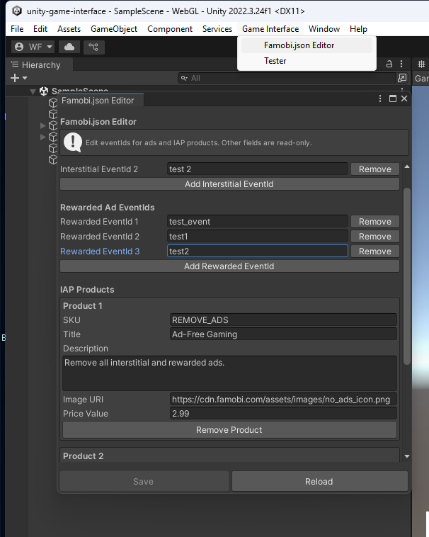
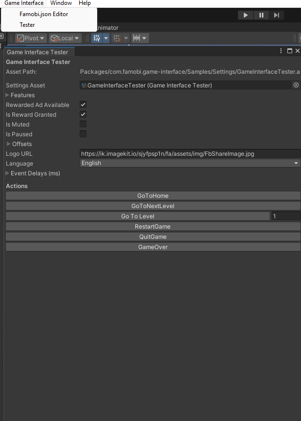
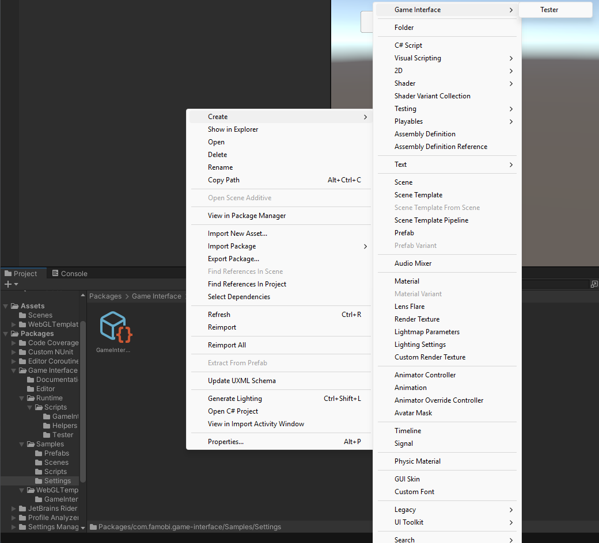
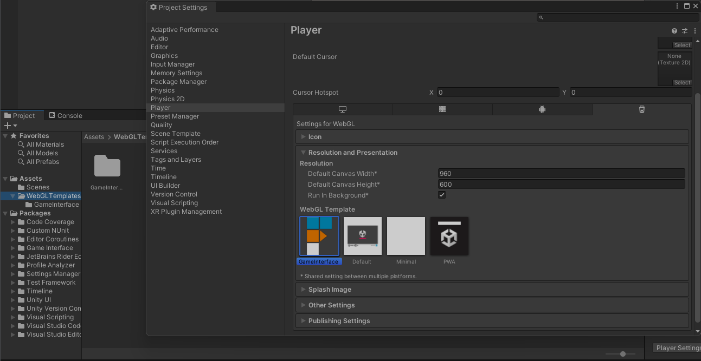

# 📖 Documentation

## Table of Contents

- [Introduction](#introduction)
- [Installation](#installation)
- [Before you start](#before-you-start)
- [Usage](#usage)
  - [Promises](#promises)
    - [Callback](#callback)
    - [Async/Await](#asyncawait)
    - [Coroutines](#coroutines)
  - [Events Handling](#events-handling)
  - [famobi.json](#famobi.json)
  - [Additional Features](#additional-features)
  - [Storage](#storage)
- [Runtime testing](#runtime-testing)
- [Samples](#samples)
- [Build](#build)
  - [WebGL Template](#webgl-template)
  - [Custom Splash Screen](#custom-splash-screen)
  - [Post Build Validator](#post-build-validator)

## Introduction

**Game Interface Package** provides a bridge between Unity's C# environment and JavaScript APIs.  
It allows your Unity games to seamlessly communicate with the GameInterface web layer.

This package simplifies integration by exposing a single entry point — the `GameInterface` singleton.

⚠️ **IMPORTANT: Before you start implementing, you must read the official Game Interface documentation at [https://docs.famobi.com/](https://docs.famobi.com/). This documentation defines the contract your game must follow and contains critical information about integration requirements.**

## Before you start

**🔴 CRITICAL: Read the official Game Interface documentation first!**

Before implementing anything, you **must** read the official Game Interface documentation end‑to‑end. It defines the contract your game must follow:

**📚 Documentation: [https://docs.famobi.com/](https://docs.famobi.com/)**

**Key areas covered in the documentation** (you will likely need all of these):

- **START**: init timing, preload progress, gameReady
- **GAME**: gameStart/gameComplete/gameOver/gameQuit sequencing
- **AUDIO/PAUSE**: master mute/pause handling and feature flags
- **ADS**: button/break triggers, rewarded availability, banner offsets, eventIds in famobi.json
- **STORAGE/TRACKING**: replace storage, GA events

⚠️ **If something in this README differs from the documentation, the documentation at [https://docs.famobi.com/](https://docs.famobi.com/) always takes precedence.**

## Installation

You can install the Game Interface package directly from Git using [Unity’s Package Manager](https://docs.unity3d.com/Manual/upm-ui-giturl.html).

1. Open **Window/Package Manager** in Unity.
2. Click on the **+** button in the top left corner.
3. Select **Add package from git URL** and paste the following URL:

```
https://github.com/wanted5games/unity-game-interface-package.git
```

## Usage

All API calls are accessible via the `GameInterface` singleton instance. This singleton mirrors the JavaScript API described in the [documentation](https://docs.famobi.com/) as closely as possible.

💡 **Tip**: Refer to the [documentation](https://docs.famobi.com/) for detailed API specifications, best practices, and integration requirements.

```C#
GameInterface.Instance.GameReady();
```

### Promises

In JavaScript we use [Promises](https://developer.mozilla.org/en-US/docs/Web/JavaScript/Reference/Global_Objects/Promise) to execute asynchronous code. Promises don't exist in Unity, but similar features exist in C#. They can be implemented in 3 ways:

#### Callback

Simplest approach — pass a callback function to handle the result once completed. You can also provide an error callback to handle failures.

```C#
public void ShowRewardedAd()
{
    GameInterface.Instance.ShowRewardedAd("test_event",
        (result) =>
        {
            if (result.isRewardGranted)
            {
                // Reward the player.
            }
        },
        (error) =>
        {
            Debug.LogError($"Ad failed to show: {error}");
            // Handle error (e.g., show a message to the player)
        });
}
```

#### Async/await

In Unity we can make use of [async/await](https://docs.unity3d.com/6000.2/Documentation/Manual/async-await-support.html). Use try-catch to handle errors.

```C#
public async void ShowRewardedAd()
{
    try
    {
        var result = await GameInterface.Instance.ShowRewardedAd("test_event");

        if (result.isRewardGranted)
        {
            // Reward the player.
        }
    }
    catch (Exception e)
    {
        Debug.LogError($"Ad failed to show: {e.Message}");
        // Handle error
    }
}
```

#### Coroutines

You can also wait for asynchronous operations inside a coroutine. The `TaskExtensions` class (provided by this package) converts Tasks to Coroutines.

```C#
using System.Collections;

private IEnumerator ShowRewardedAdCoroutine()
{
    Task<RewardedAdResult> task = GameInterface.Instance.ShowRewardedAd("test_event");
    yield return TaskExtensions.WaitForTask(task);

    if (task.IsFaulted)
    {
        Debug.LogError($"Ad failed to show: {task.Exception?.GetBaseException().Message}");
        // Handle error
        yield break;
    }

    var result = task.Result;
    if (result.isRewardGranted)
    {
        // Reward the player.
    }
}
```

### Events Handling

You can listen for Game Interface events (e.g., OnGoToNextLevel) by subscribing to them.

```C#
public void OnEnable()
{
    GameInterface.Instance.OnGoToNextLevel += HandleGoToNextLevel;
    GameInterface.Instance.OnRewardedAdAvailabilityChange += HandleRewardedAdAvailabilityChange;
}

public void OnDisable()
{
    GameInterface.Instance.OnGoToNextLevel -= HandleGoToNextLevel;
    GameInterface.Instance.OnRewardedAdAvailabilityChange -= HandleRewardedAdAvailabilityChange;
}

```

⚠️ Always unsubscribe from events in OnDisable to prevent memory leaks.

### famobi.json

The `famobi.json` file is required for your game and must be located in the WebGL template folder (`Assets/WebGLTemplates/GameInterface/famobi.json`). This file lists all ad eventIds and IAP products used in your game.

**Instead of editing the JSON file directly**, you can use the **Famobi.json Editor** window:

1. Open **Game Interface ▸ Famobi.json Editor** from the Unity menu bar
2. Edit your ad eventIds (interstitial and rewarded)
3. Edit your IAP products (SKU, title, description, image URI, price)



⚠️ **Important**:

- All eventIds used in your game must be listed in this file. See the [documentation](https://docs.famobi.com/ads) for details.
- IAP products defined in `famobi.json` are automatically loaded and merged with API results when calling `GetProducts()`. Products are shuffled for each call.

### Additional Features

The following new methods have been added to the `GameInterface` API to improve flexibility and control over runtime behavior:

```C#
// Disable the custom splash screen.
GameInterface.Instance.DisableSplashScreen();

// Initialize an event listener for visibility changes (if supported by the platform).
GameInterface.Instance.InitVisibilityChange();

// Resize the game canvas, applying the offset for the banner.
GameInterface.Instance.ResizeGameCanvas();
```

### Storage

The `GameInterface` storage system replaces Unity's `PlayerPrefs` and provides:

- **Automatic caching**: Storage reads are cached in memory to reduce overhead
- **Size monitoring**: Warnings are logged when individual items or total storage size approach limits (default: 1 MB each)
- **Configurable limits**: Adjust `GameInterface.Instance.MaxStorageItemBytes` and `MaxTotalStorageBytes` if needed

```C#
// Store data (automatically cached)
GameInterface.Instance.SetStorageItem("playerName", "Player1");
GameInterface.Instance.SetStorageItem("highScore", 1000);

// Retrieve data (uses cache if available)
string name = GameInterface.Instance.GetStorageItem<string>("playerName");
int score = GameInterface.Instance.GetStorageItem<int>("highScore");

// Clear storage
GameInterface.Instance.ClearStorage();
```

## Runtime testing

You can adjust settings and trigger events during gameplay to test different features of the Game Interface API. The testing window can be found under Game Interface ▸ Tester in the Unity menu bar.



The settings asset used by this window is located at: `Packages/Game Interface/Samples/Settings/GameInterfaceTester.asset`.

If you prefer to keep this asset inside your Assets/ folder, you can create a new one via:


⚠️ Important: Don't forget to assign your new asset to the Game Interface Tester window.

### Testing Features

The Game Interface Tester window provides several testing features:

- **Event Delays**: Configure delays (in milliseconds) for game events (GameStart, GameComplete, etc.), IAP events, and ad events to simulate network latency
- **Interstitial Ad Cooldown**: Set a cooldown period (in milliseconds) between interstitial ad displays
- **Ad Overlay**: In the Unity Editor, ads are displayed as overlays with interactive buttons:
  - Interstitial ads show a "Close Ad" button
  - Rewarded ads show "Grant Reward" and "Reject Reward" buttons for testing different reward scenarios
- **Runtime State**: Adjust various runtime states like muted/paused status, rewarded ad availability, and more

## Samples

A sample scene is included to help you quickly test and understand the Game Interface features.

- **Scene:** `Packages/Game Interface/Samples/Scenes/SampleScene.scene`
- **Example Script:** `Packages/Game Interface/Samples/Scripts/GameInterfaceExample.cs`

⚠️ **Important**: To open the sample scene, you must copy it to your `Assets/` folder first. Scenes located in the `Packages/` folder cannot be opened directly in Unity.

These demonstrate how to use the Game Interface API and test event hooks during gameplay.

## Build

When importing this package, a new folder named **Game Interface** is automatically generated in your project's `Assets/` directory.
This folder contains a required WebGL Template used for proper integration with the JavaScript API.
If the folder was not created automatically, copy it manually from: `Packages/com.famobi.game-interface/WebGLTemplates/GameInterface` to `Assets/WebGLTemplates/GameInterface`.

### WebGL Template

Before making a build, make sure that you have selected the WebGL Template in the Player Settings.

Before building your WebGL project:

Open Edit ▸ Project Settings ▸ Player ▸ Resolution and Presentation

Select the WebGL Template created by the package.



💡 Tip: Always use the provided WebGL Template when building your game to ensure correct integration with the Game Interface runtime.

### Custom Splash Screen

The Game Interface splash screen is a custom HTML/CSS page that displays when the game first loads. You can edit it to match your game's branding, but avoid removing required JavaScript hooks. The splash screen can be found in `Assets/WebGLTemplates/GameInterface/index.html` (created automatically when the package is imported).

### Post Build Validator

After creating a WebGL build, the package runs post-build scripts to ensure your build complies with Game Interface standards.
These checks help prevent runtime errors and ensure smooth integration with the Game Interface API.

The checker verifies:

- [x] No single file is larger than 10 MB.
- [x] The total bundle size does not exceed 100 MB.
- [x] File and folder names do not contain symbols or spaces.
- [x] A compression format is selected.
- [x] Compression fallback is enabled.
