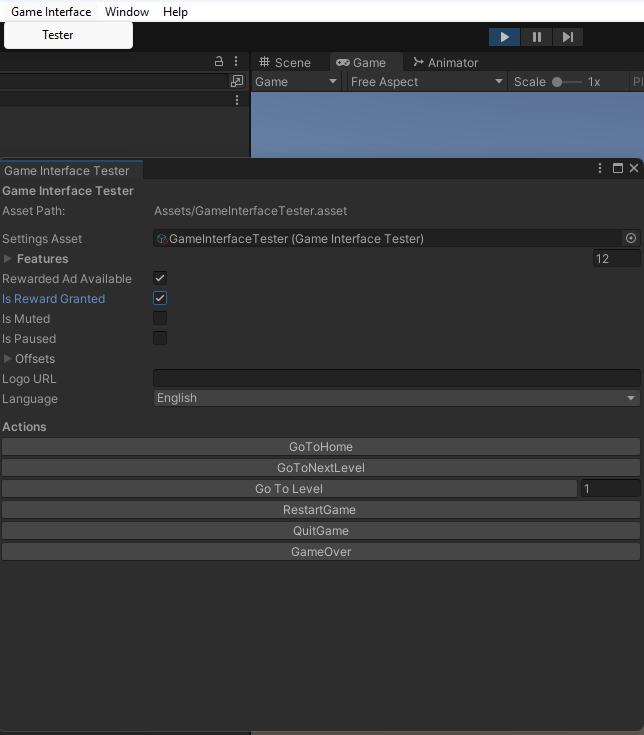

# 📖 Documentation

## Table of Contents

- [Introduction](#introduction)
- [Installation](#-installation)
- [Usage](#usage)
  - [Promises](#promises)
    - [Callback](#callback)
    - [Async/Await](#asyncawait)
    - [Coroutines](#coroutines)
  - [Events Handling](#events)
  - [New Features](#new-features)
  - [Custom Splash Screen](#custom-splash-screen)
- [Runtime testing](#runtime-testing)
- [Samples](#samples)

## Introduction

**Game Interface** provides a bridge between Unity’s C# environment and JavaScript APIs.  
It allows your Unity games to seamlessly communicate with the GameInterface web layer.

This package simplifies integration by exposing a single entry point — the `GameInterface` singleton.

## 📦 Installation

You can install the Game Interface package directly from Git using [Unity’s Package Manager](https://docs.unity3d.com/Manual/upm-ui-giturl.html).

1. Open **Window/Package Manager** in Unity.
2. Click on the **+** button in the top left corner.
3. Select **Add package from git URL** and paste the following URL:

```
https://github.com/.....
```

## Usage

All API calls are accessible via the `GameInterface` singleton instance.

```C#
GameInterface.Instance.GameReady();
GameInterface.GetInstance().GameReady();
```

### Promises

In JavaScript we use [Promises](https://developer.mozilla.org/en-US/docs/Web/JavaScript/Reference/Global_Objects/Promise) to execute asynchronous code. Promises don't exist in Unity, but there are similar features existing in C#. It can be implemented in 3 ways:

#### Callback

Simplest approach — pass a callback function to handle the result once completed.

```C#
public void ShowRewardedAd()
{
    GameInterface.Instance.ShowRewardedAd("test_event", (result) =>
    {
        if (result.isRewardGranted)
        {
            // Reward the player.
        }
    });
}
```

#### Async/await

In Unity we can make use of [async/await](https://docs.unity3d.com/6000.2/Documentation/Manual/async-await-support.html).

```C#
public async void ShowRewardedAd()
{
    var result = await GameInterface.Instance.ShowRewardedAd("test_event");

    if (result.isRewardGranted)
    {
        // Reward the player.
    }
}
```

#### Coroutines

You can also wait for asynchronous operations inside a coroutine.

```C#
private IEnumerator ShowRewardedAdCoroutine()
{
    Task task = GameInterface.Instance.ShowRewardedAd("test_event");
    yield return TaskExtensions.WaitForTask(task);
    var result = task.Result;

    if (result.isRewardGranted) {
        // Reward the player.
    }
}
```

### Events Handling

You can listen for Game Interface events (e.g., OnGoToNextLevel) by subscribing to them.

```C#
public void OnEnable()
{
    GameInterface.Instance.OnGoToNextLevel += HandleGoToNextLevel;
}

public void OnDisable()
{
    GameInterface.Instance.OnGoToNextLevel -= HandleGoToNextLevel;
}

```

⚠️ Always unsubscribe from events in OnDisable to prevent memory leaks.

### New features

The following new methods have been added to the `GameInterface` API to improve flexibility and control over runtime behavior:

```C#
// Disable the custom splash screen.
GameInterface.Instance.DisableSplashScreen();

// Initialize an event listener for visibility changes (if supported by the platform).
GameInterface.Instance.InitVisibilityChange();

// Resize the game canvas, applying the offset for the banner.
GameInterface.Instance.ResizeGameCanvas();
```

### Custom Splash Screen

The Game Interface splash screen is a custom HTML/CSS page that displays when the game first loads. You can edit it to match your game’s branding, but avoid removing required JavaScript hooks. You can edit it in the file `index.html`.

## Runtime testing

You can adjust settings and trigger events during gameplay to test different features of the Game Interface API. The testing window can be found under Game Interface ▸ Tester in the Unity menu bar.



The settings asset used by this window is located at: `Packages/Game Interface/Samples/Settings/GameInterfaceTester.asset`.

If you prefer to keep this asset inside your Assets/ folder, you can create a new one via:


⚠️ Important: Don’t forget to assign your new asset to the Game Interface Tester window.

## Samples

A sample scene is included to help you quickly test and understand the Game Interface features.

- **Scene:** `Packages/Game Interface/Samples/Scenes/SampleScene.scene`
- **Example Script:** `Packages/Game Interface/Samples/Scripts/GameInterfaceExample.cs`

These demonstrate how to use the Game Interface API and test event hooks during gameplay.

## Build

When importing this package, a new folder named Game Interface is automatically generated in your project’s Assets/ directory.
This folder contains a required WebGL Template used for proper integration with the JavaScript API.
If the folder was not created automatically, copy it manually from: `Packages/Game Interface/WebGLTemplates`

Before making a build, make sure that you have selected the WebGLTemplate in the PlayerSettings

Before building your WebGL project:

Open Edit ▸ Project Settings ▸ Player ▸ Resolution and Presentation

Select the WebGL Template created by the package.


💡 Tip: Always use the provided WebGL Template when building your game to ensure correct integration with the Game Interface runtime.

### Post Build Checker

After creating a WebGL build, the package runs post-build scripts to ensure your build complies with Game Interface standards.
These checks help prevent runtime errors and ensure smooth integration with the Game Interface API.

The checker verifies:

- [ ] No single file is larger than 10 MB.
- [ ] The total bundle size does not exceed 100 MB.
- [ ] File and folder names do not contain symbols or spaces.
- [ ] A compression format is selected.
- [ ] Compression fallback is enabled.
